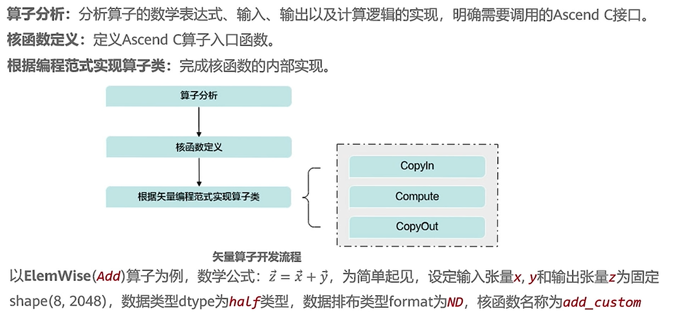
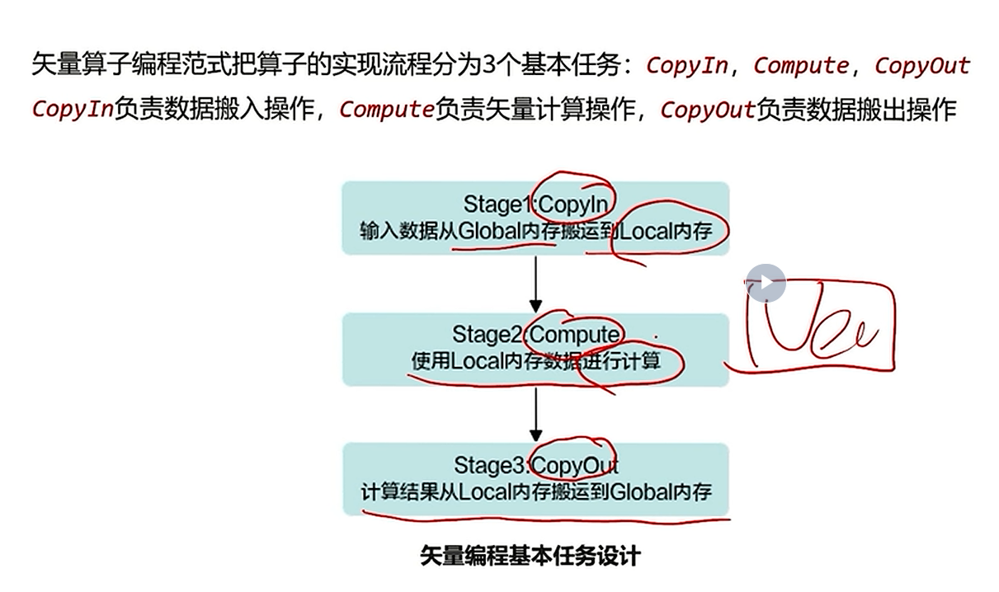

# 一、Add算子前世今生

## 1.1 AI core架构抽象回顾

## 1.2 Ascend C的编程对象

### 存储
- 外部存储
```cpp
template <typename T> class GlobalTensor {
    void SetGlobalBuffer(__gm__ T* buffer, uint32_t buffer_size);
}

```


- 内部存储


### 逻辑位置 数据依赖
会具体说明

## 1.3 Vector算子开发流程——以Add算子为例
### 开发流程


- side note: `half` 半精度浮点
### 算子分析


### 核函数定义（kernel侧的实现）


### 编程范式

:yum: 有大框架了

#### SPMD
SIMD(Single-Instruction Multiple-Data)是核内的，SPMD(Single-Program Multiple-Data)是核间的


注意idx怎么获取的
#### 流水任务


和cpu优化一个道理

#### 矢量编程流水任务设计
有汇编那味了:yum:



伪代码实现


代码实现
- interface: （local tensor不在这里）


- **Init()**

- **Process()**


- DoubleBuffer()机制

参考代码实现里 `BUFFER_NUM` 的定义

- Conclusion


## 1.4 运行验证

### tree of content


算子调用示例sample

直接调用——kernel直调


side note: *Neo指代新手*
