# 二、Host侧实现

## 2.1 Host侧实现概述
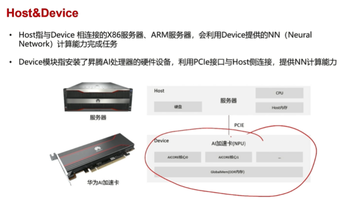

in `op_host` directory...
Host的任务主要是
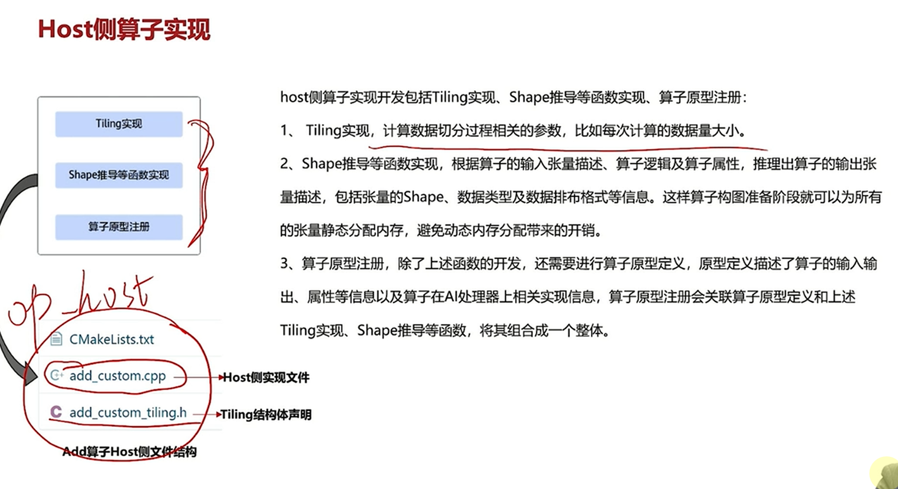

## 2.2 Tiling下发
即所谓切片:yum:
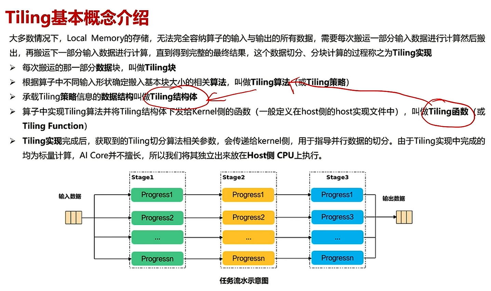

### 结构体
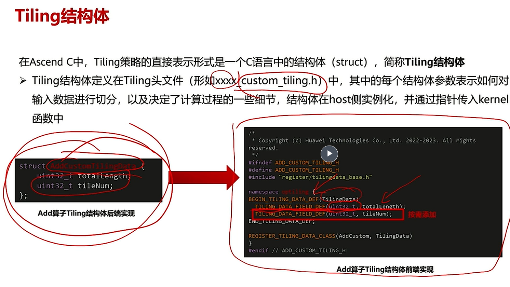
### 两侧Tiling实现
Host打包信息
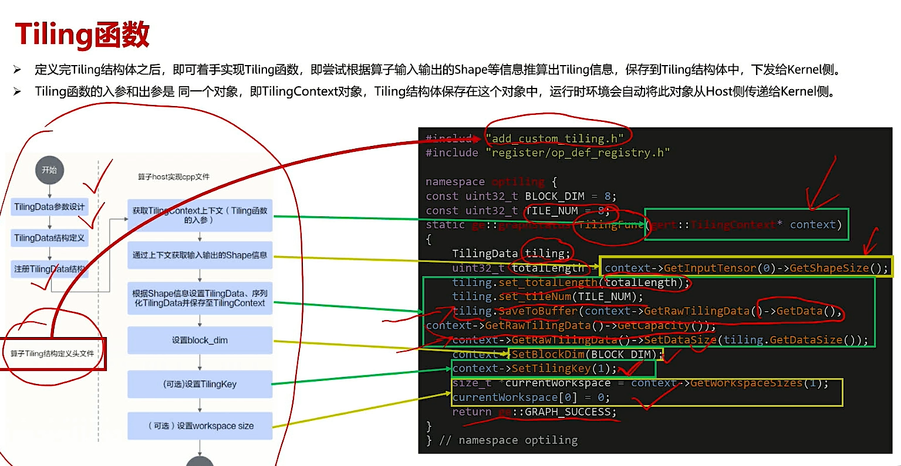

Device侧解包
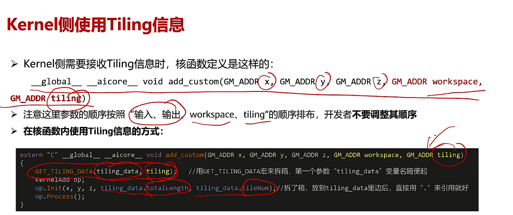
### 静态动态shape
- 静态shape：在编译时确定，在运行时不可变，注意 `total_len`, `block_len`, `tile_num` 等参数
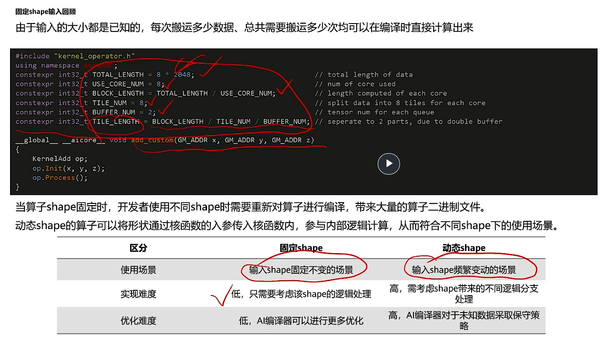
- 动态shape：在运行时确定，在编译时不可变
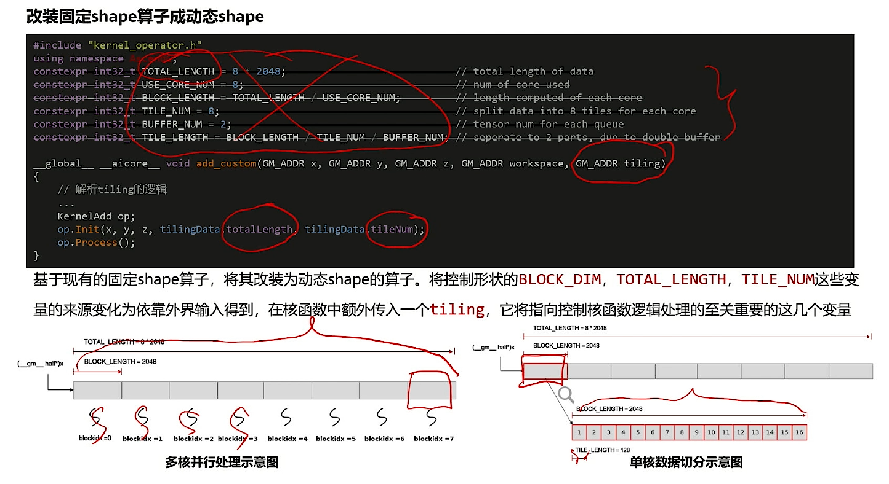

- 对比：
- 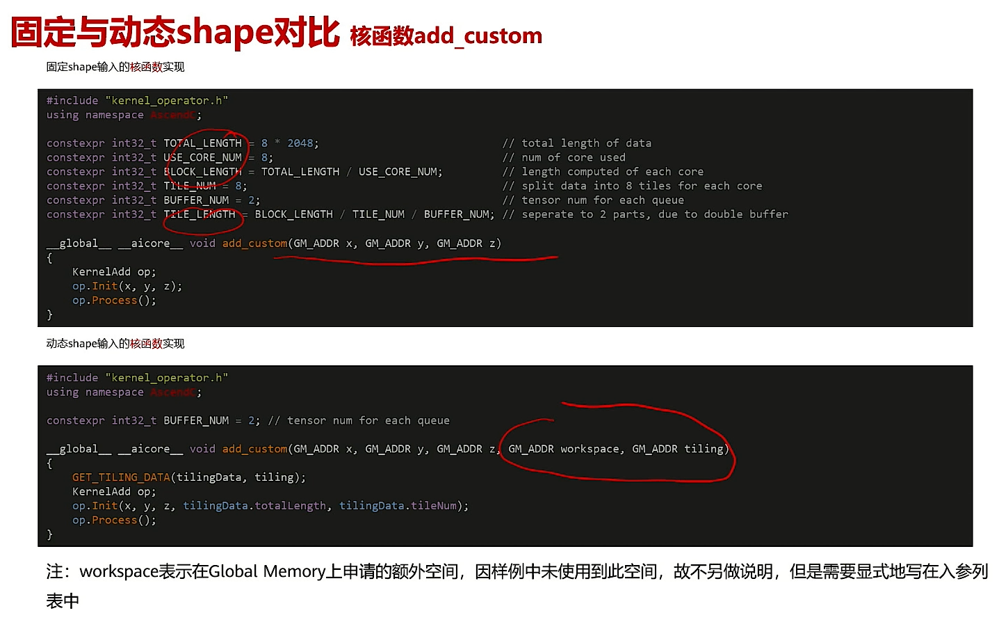
- 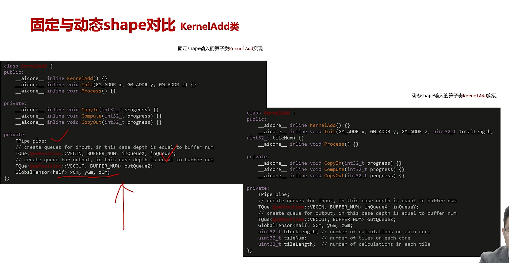
- 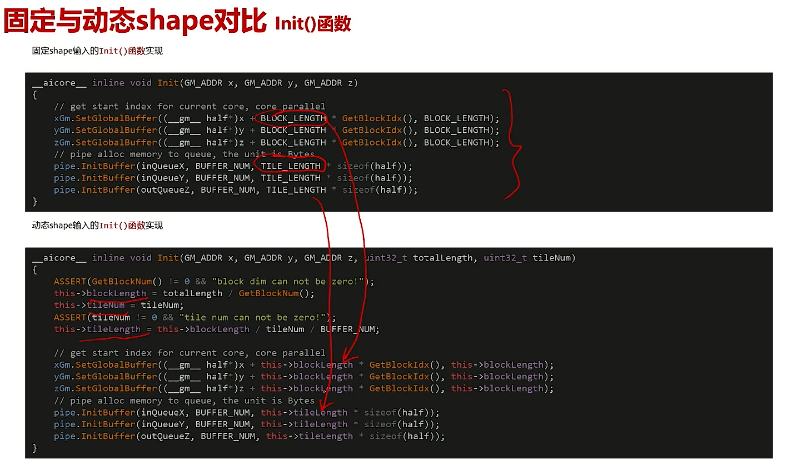
- 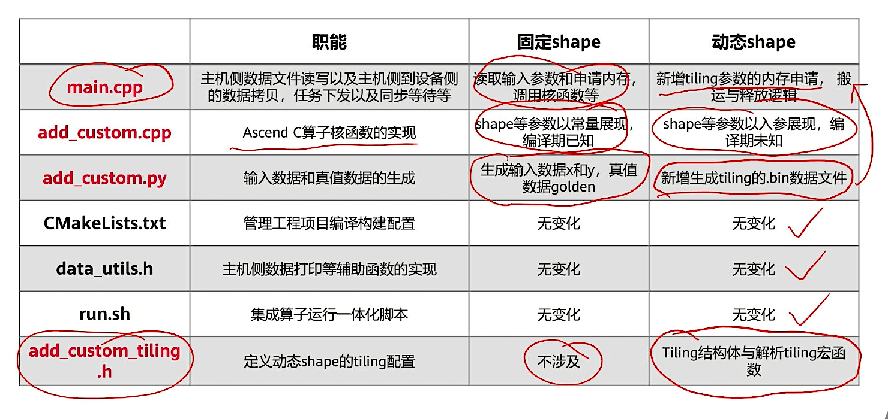
静态常量->动态成员变量

## 2.3 Shape推导
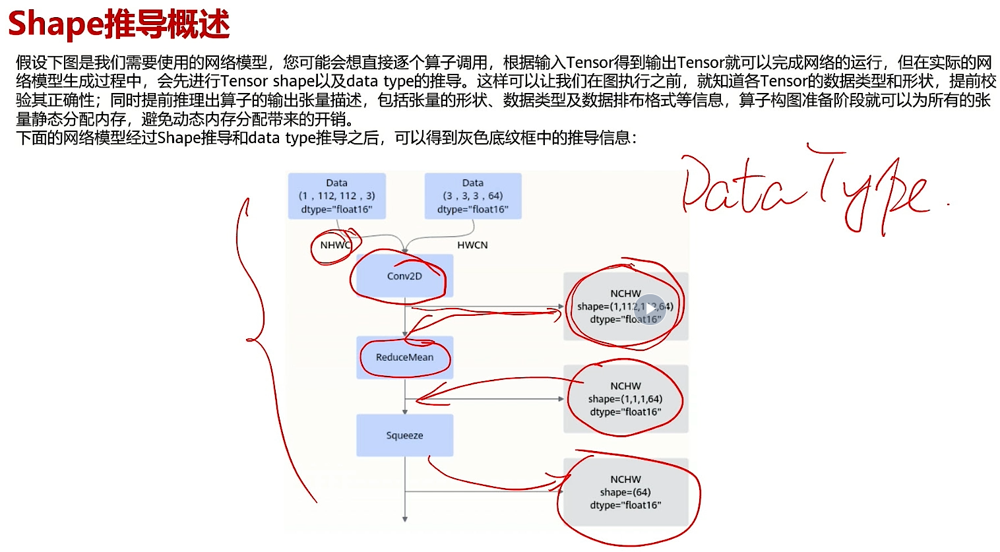

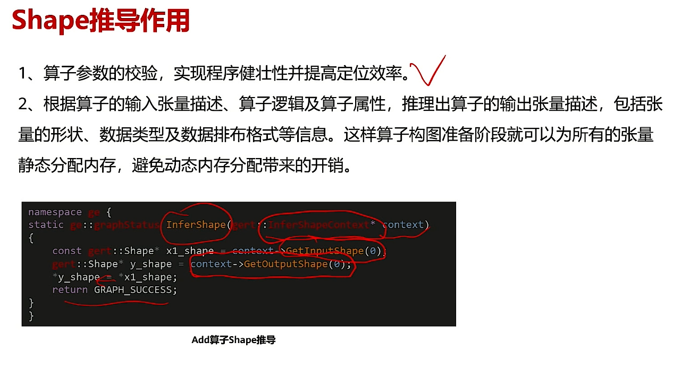
这就不得不提到CMU 10-414传奇推导法了:yum:

## 2.4 原型注册
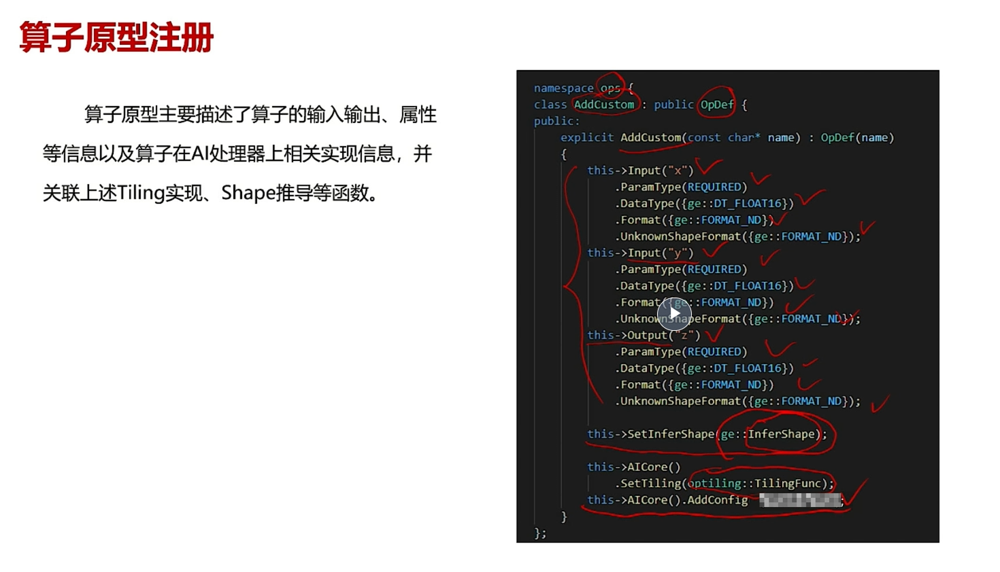
register basic info of op :thinking:

side note: `xxxx_out` 有可能有许多的结果和帮助

