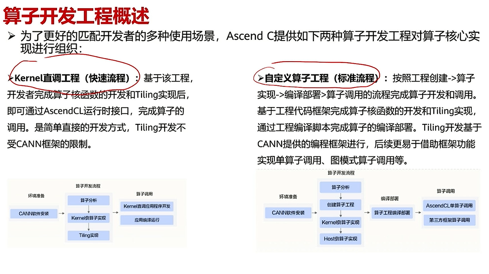
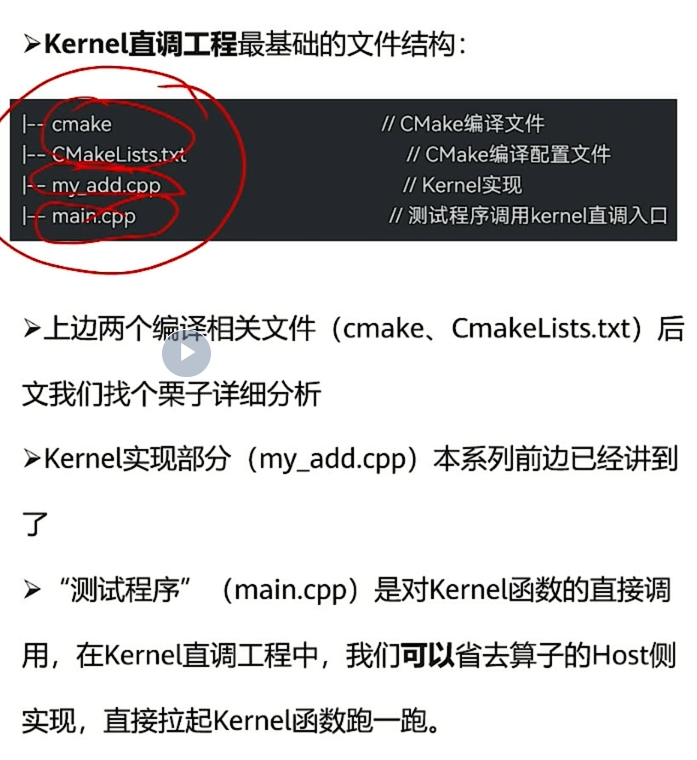
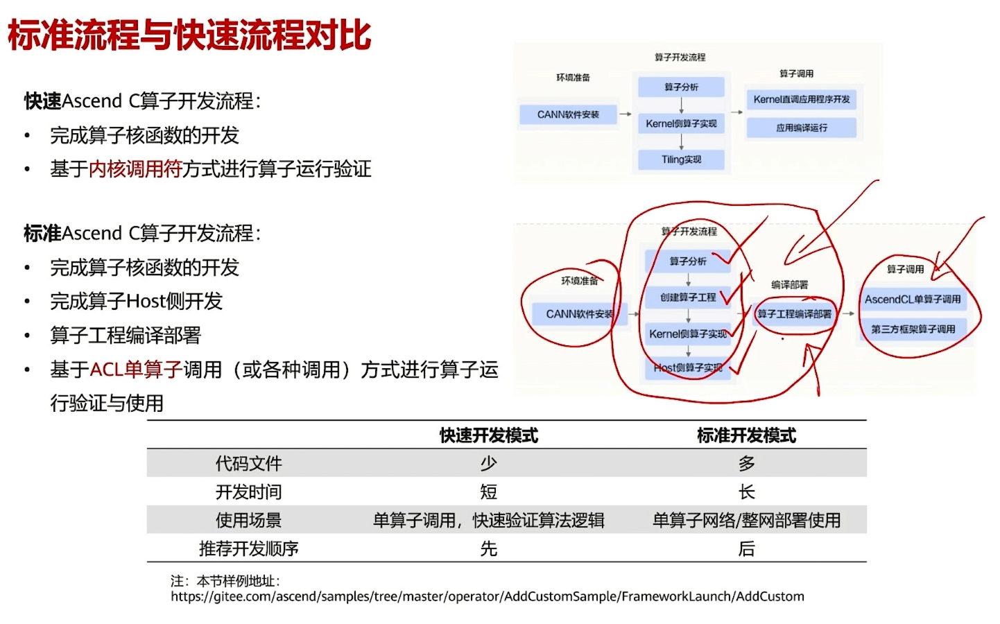
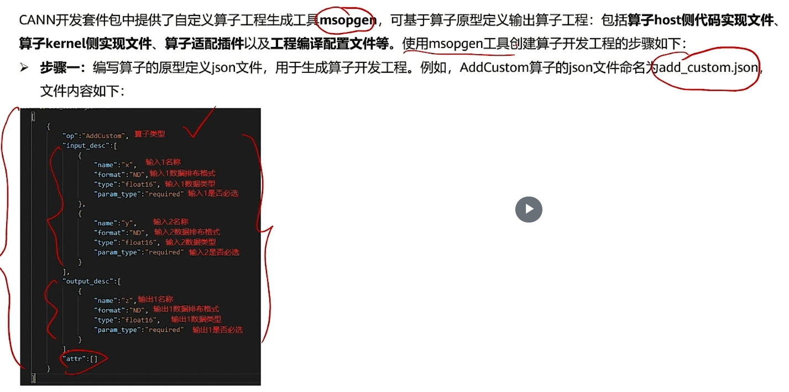
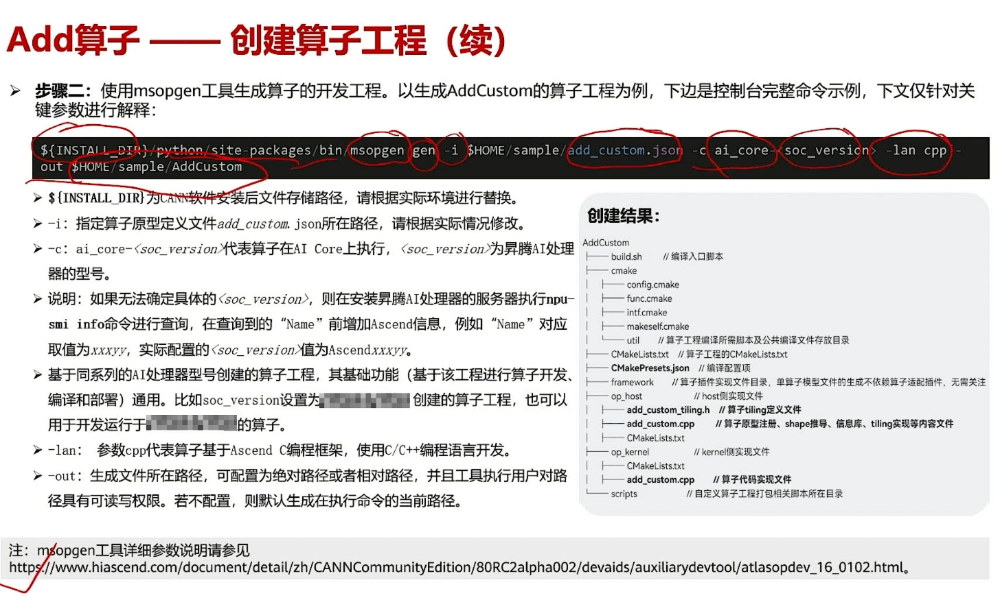
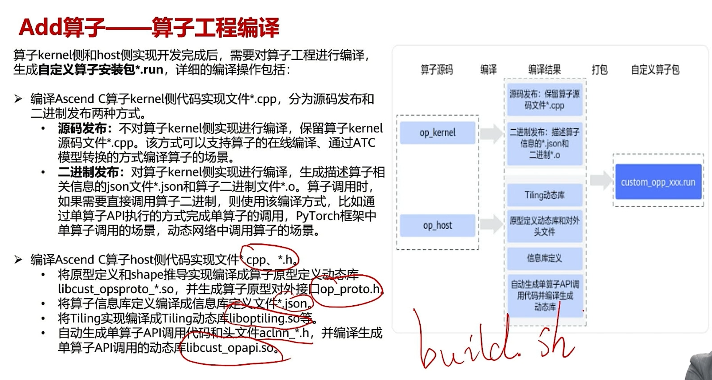
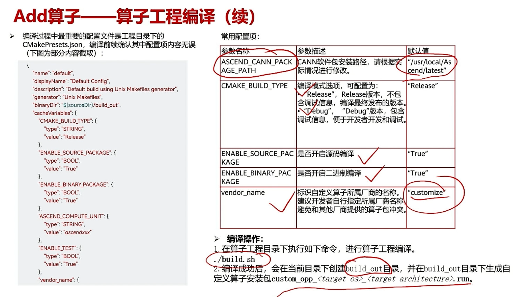
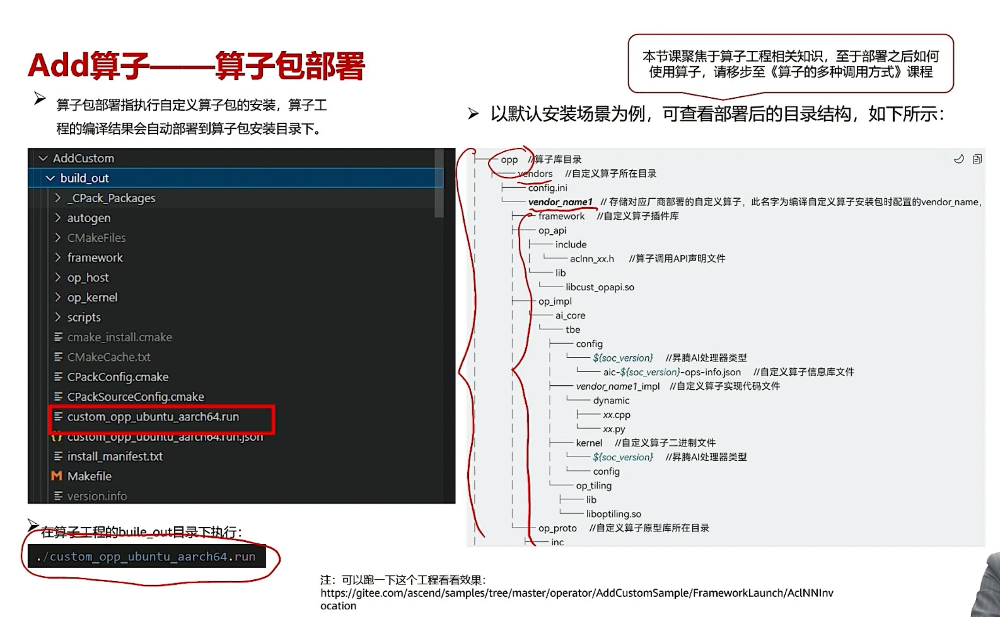

# 算子开发工程
经验之谈
## 3.1 算子开发概述




## 3.2 快速流程——kernel直调工程
不怎么考虑host


`usr/local/Asecend/ascend-toolkit/` 目录下可以看见版本号

`/KernelLaunch/` 直调

快速prototype看这里！！！

## 3.3 标准流程——自定义算子工程
对比


### 创建算子工程
```bash
$ msopgen .........
```




### 编写算子代码——见之前的模块
### 编译算子





