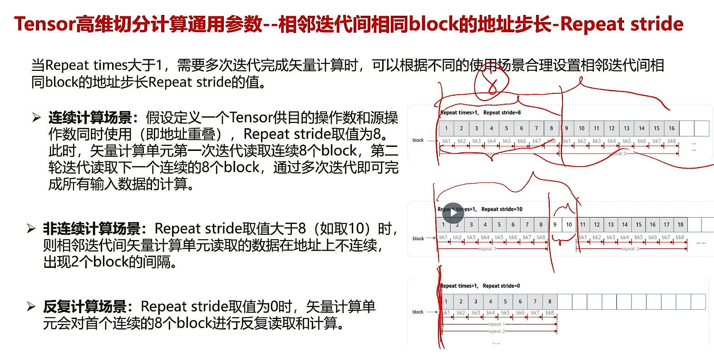
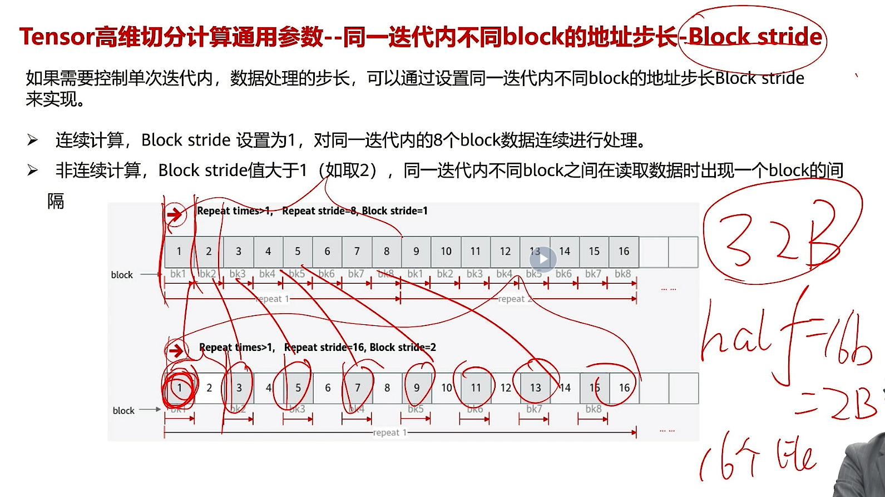

# API 通用解读
来了，避免重复造轮子
## 4.1 Ascend C编程API概述

## 4.2 基础API


### 计算库API
#### 整个Tensor的计算
四则运算、按位与或，等不等

#### 前n个元素的计算
```cpp
Add(dst, src1, src2, n)
```

#### 高维度切分计算
通用参数


- repeat times:不要超过255


在这里1 block 对应 32 Byte

- Repeat stride:地址的步长，单位block


- Block size:每个block的大小



- mask
  - 连续模式


传入{1,1,1,8,8,8}指的是上面提到的参数binaryRepeatParams
  - 逐bit模式 -> mask比特作为索引去访问一次256Byte的读写单元


### 数据搬运API


对于 `DataCopyParams` 来说


### 内存管理API


避免直接使用cpp的new/delete
### 任务同步API


## 4.3 高阶API


***Sinh?***


[社区链接](https://www.hiascend.com/document/detail/zh/CANNCommunityEdition/800alpha001/devguide/opdevg/ascendcopdevg/atlas_ascendc_10_0028.html)


side note: 双目/单目算子
注意使用基础api！！！
