# 算子的调用方式

## 5.1 概述


## 5.2 kernel直调
调用在kernel侧算子工程 `main.cpp` 中

- cpu算子调用方式
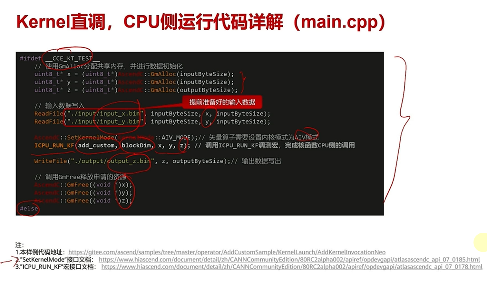    
  - blkdim: aicore的数量
- npu算子调用方式
  - 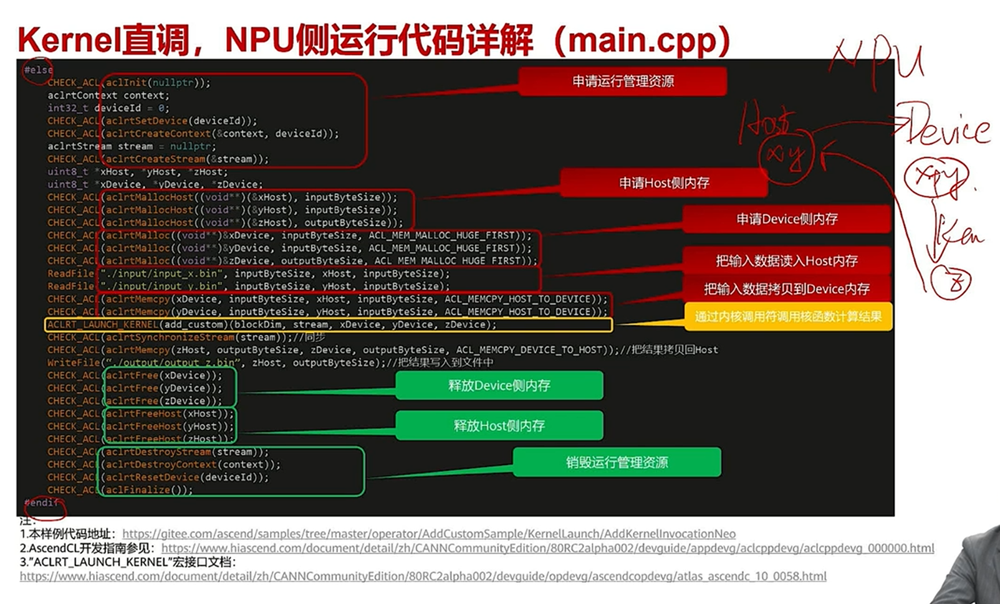

kernel side同样可以传入tiling但是不重要？因为只关注快速验证
```shell
bash run.sh -r ... -v ...
```
## 5.3 Ascend CL调用算子
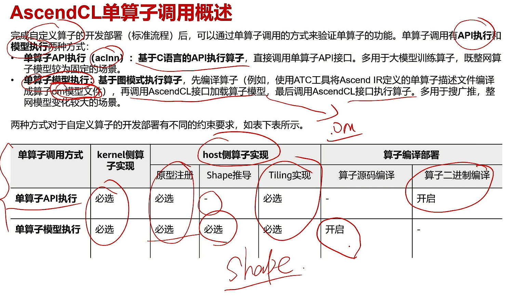
计算图更加重视shape

### 单算子API调用
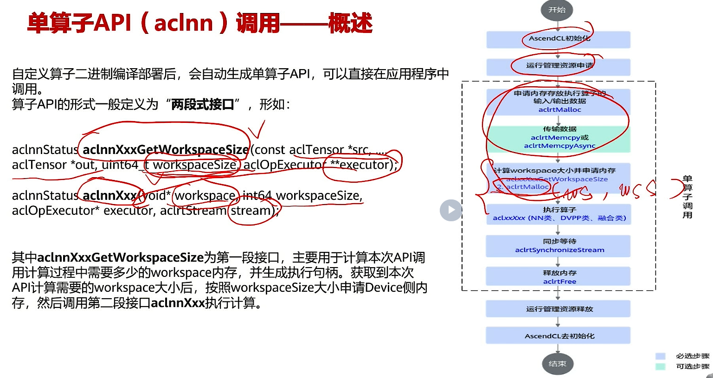
两段式调用，先计算workspace，再调用算子

关键实现
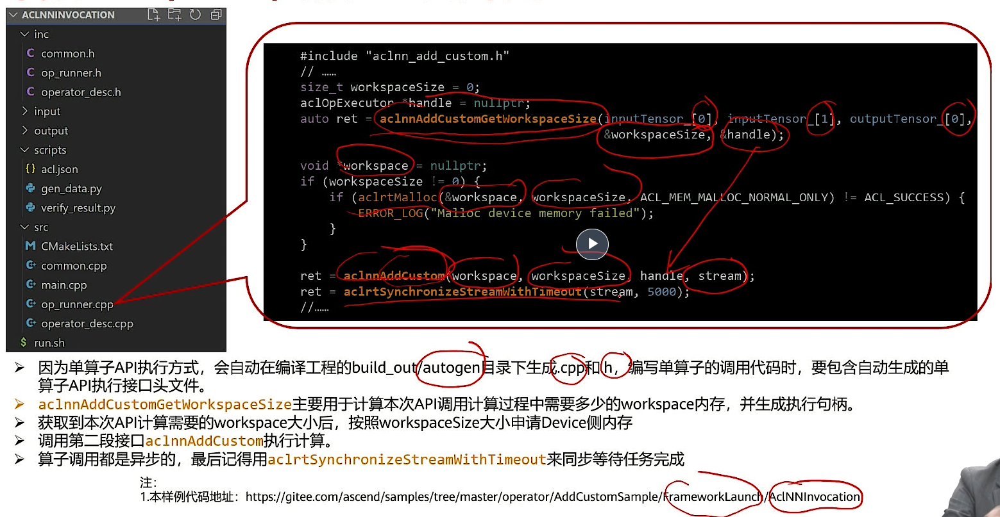

cmakelist.txt
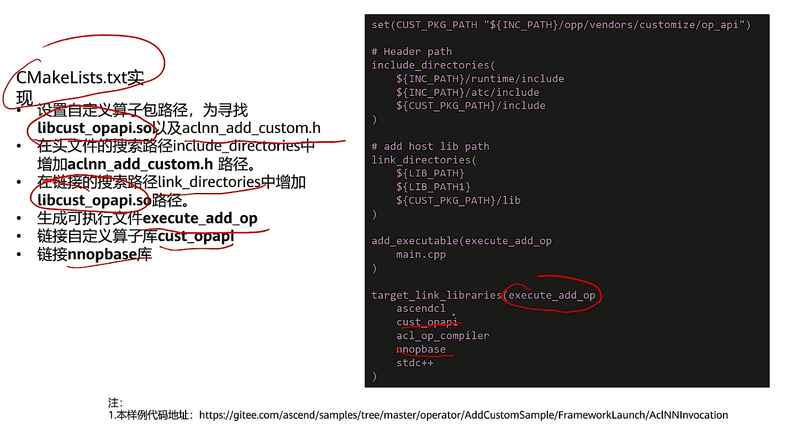


### 单算子模型执行
`AclofflineModel` 文件夹下有源码

转换为.om文件
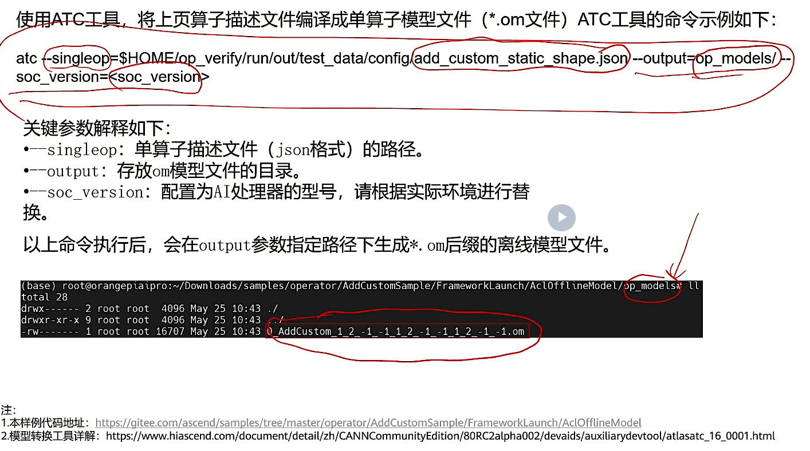

代码编写关键信息
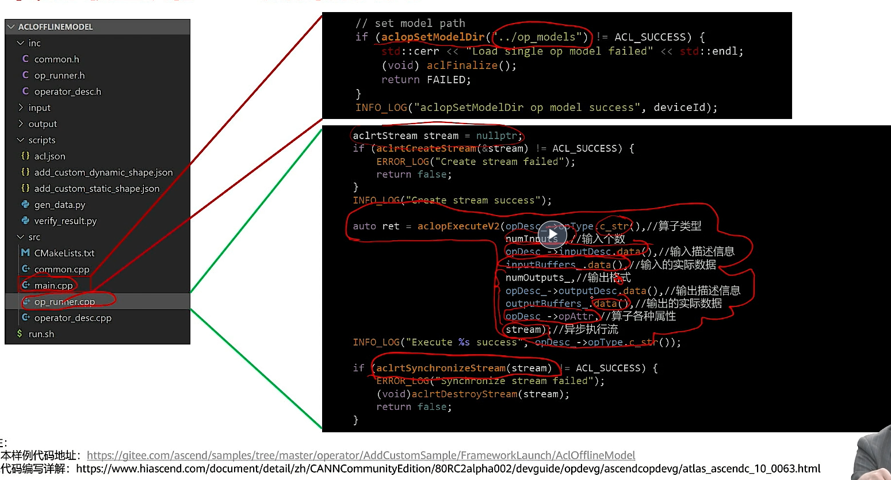

## 5.4 PyTorch调用算子
真要写就是写 `op_plugin` 里面的东西

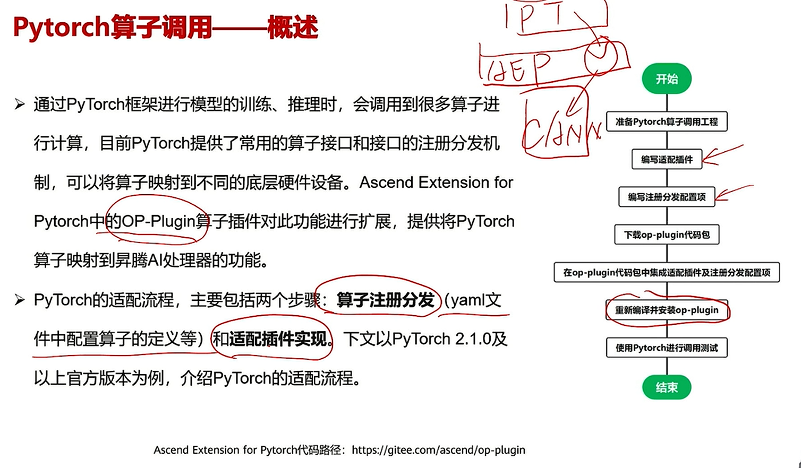
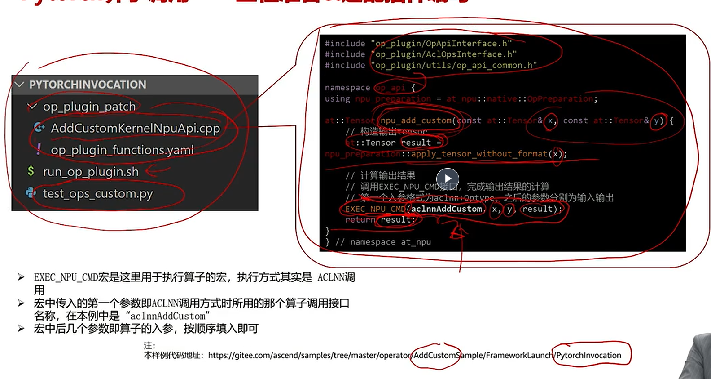
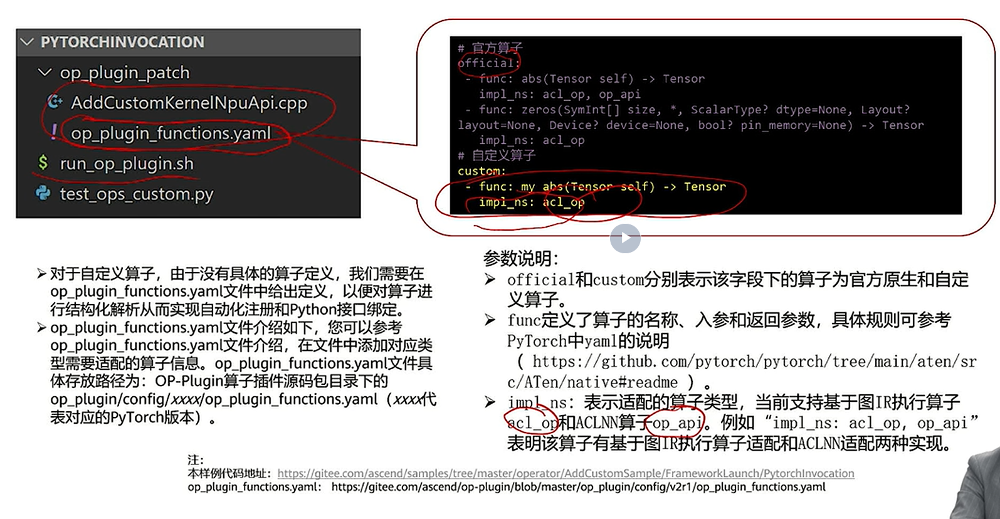

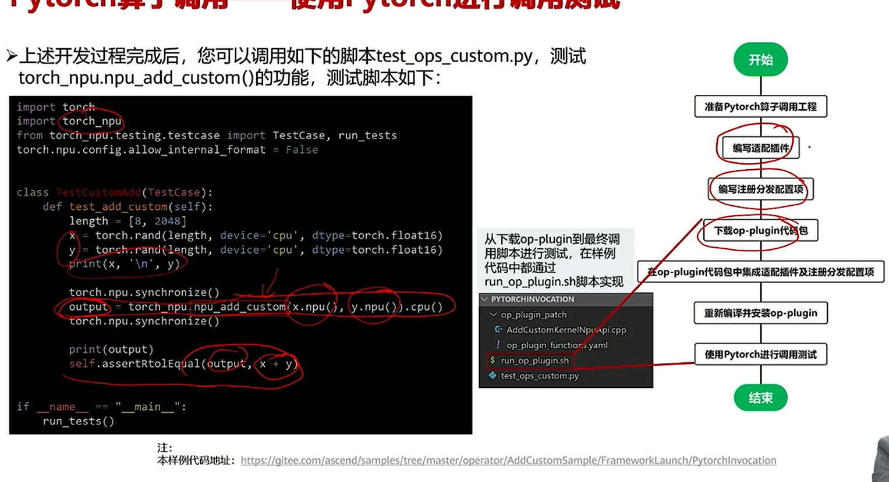
